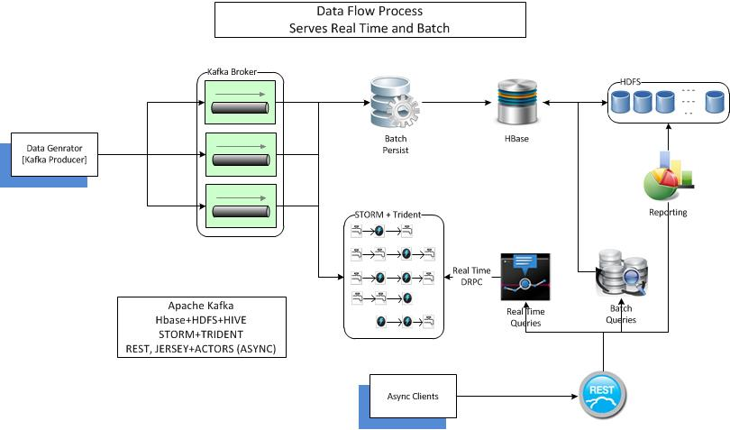

## DataFlux
data flux is a POC for lambda architecture.
flux is combination of various technologies to enable ingestion, processing, querying data @ scale.
Apache Kafka is used to initially commit the incoming data, to be read later by batch processor to persist into HBase.
Storm also consumes the data from Kafka for real time processing. 

A data generator is provided which can feed http access log for processing. It supports conversations in web transactions  enable better semantics. 

### Modules
dataflux-datagenerator -- generate web transactions data for processing
dataflux-producer -- Kafka producer 
dataflux-batchpersist -- batch layer for persisting data into HBase
dataflux-persister -- a common layer to be used in persistence

### Some key features
Datageneration tries to be as close as real world, zipfian distribution for response codes, conversation flows with unique session id, generate bursts
Flow control in batch persist
Replay failed batches
